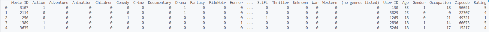
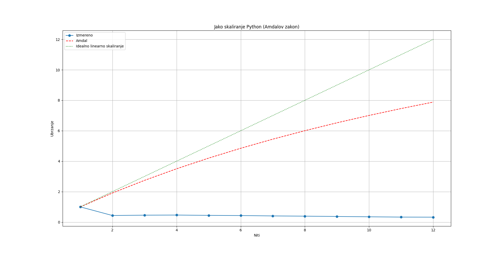
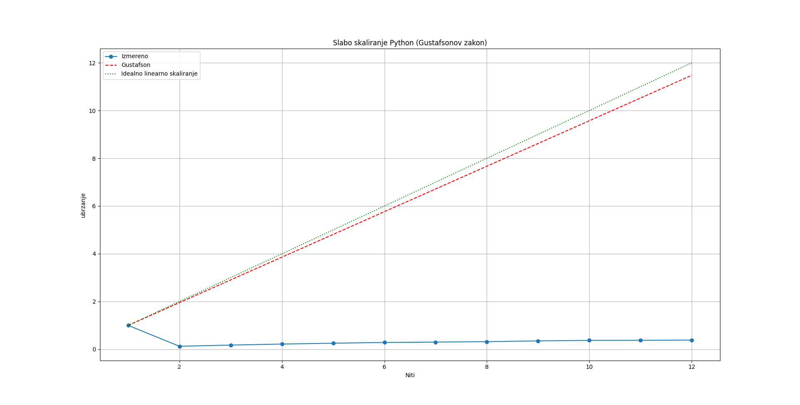
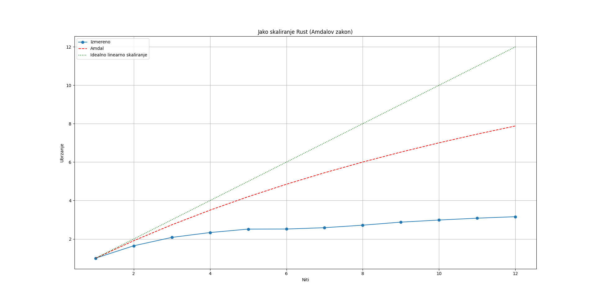
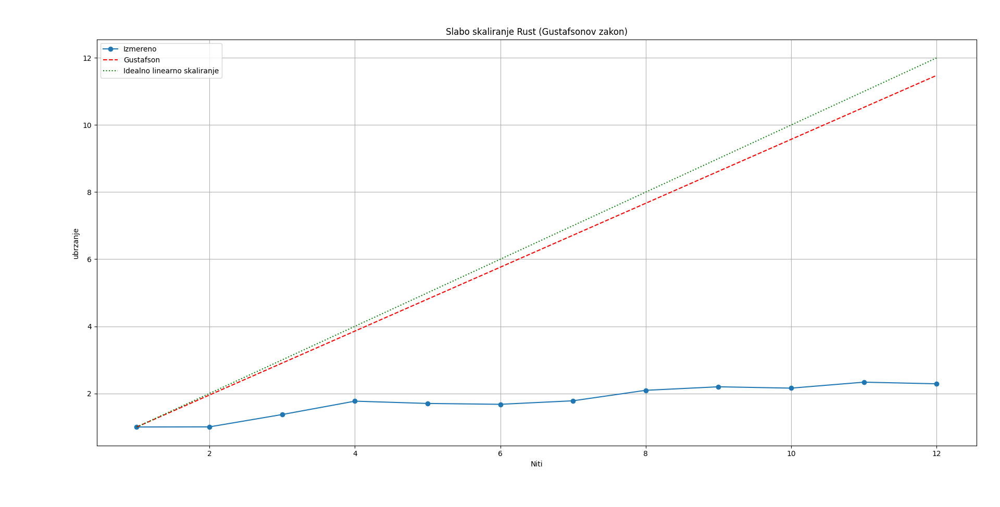
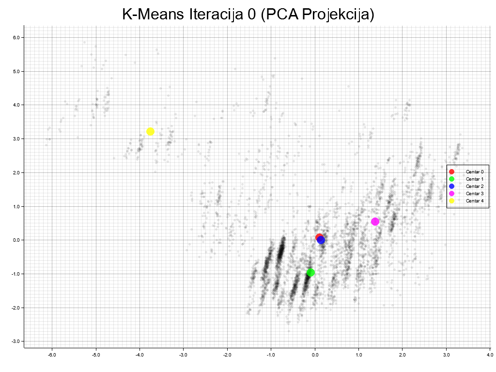

# Izveštaj iz predmeta Napredne tehnike programiranja - Sekvencijalni i paralelni K-Means algoritam

Tehnički detalji harverske arhitekture:
-	AMD Ryzen 5 4600H – 3.0 GHz, 6 cores/12 threads, Cache L1: 64 KB (per core), Cache L2: 512 KB (per core), Cache L3: 8 MB (shared), 1 NUMA node
-	16 GB DDR4 RAM
-	Nvidia GTX 1650 Ti

Tehnički detaji softverske arhitekture:
-	Windows 10 OS

Korišćene biblioteke (Python):
-	numpy-2.2.6      
-	pandas-2.3.3
-   scikitlearn

Korišćene biblioteke (Rust):
-	ndarray = "0.16"
-	csv = "1.3"
-   linfa = "0.8"
-   linfa-reduction = "0.8"
-   plotters = "0.3"

Celokupan skup sadrži 1.000.210 podataka sa 28 dimenzija. Kategoričke kolone su već One-hot enkodirane. Izvršeno je skaliranje podataka.

## Eksperimenti skaliranja

Procenat sekvencijalnog dela koda je **s=4.75%**, dok je procenat dela koji se može paralelizovati **p=95,25%**. Ove informacije su pronađene tako što je izmereno vreme izvršavanja delova koda koje je moguće i koje nije moguće paralelizovati u sekvencijalnom kodu. Delovi koje nije moguće paralelizovati su inicijalizacija centara klastera, provera konvergencije, kao i same iteracije.

Na osnovu toga teorijski maksimum ubrzanja u skladu sa Amdalovim zakonom po formuli $1 / (s + p / N)$ je **7.88**, dok teorijski maksimum ubrzanja u skladu sa Gustafsonovim zakonom po formuli $s + p × N$  je **11.4775** za **12 niti**.

Kod slabog skaliranja poslom se manipuliše tako što se sa povećavanjem broja niti propocionalno povećava broj podataka, tako da svaka nit obrađuje isti broj podataka.

| | 1 | 2 | 3 | 4 | 5 | 6 | 7 | 8 | 9 | 10 | 11 | 12 |
|-|-|-|-|-|-|-|-|-|-|-|-|-|
| Prosečno vreme | 1.2037| 2.7801| 2.6449| 2.6006 |2.7240| 2.7961| 2.9682| 3.0856| 3.2517| 3.4569| 3.6570| 3.7172|
| Standardna devijacija | 0.005566| 0.063203|  0.077686| 0.100273| 0.112460| 0.144812| 0.112536| 0.096879| 0.179154| 0.126892| 0.256861| 0.177927|

| | 1 | 2 | 3 | 4 | 5 | 6 | 7 | 8 | 9 | 10 | 11 | 12 |
|-|-|-|-|-|-|-|-|-|-|-|-|-|
| Prosečno vreme | 0.1220| 1.9647| 2.1016| 2.2464 |2.4114| 2.5791| 2.8554| 3.0761| 3.1409| 3.2780| 3.5748| 3.8160|
| Standardna devijacija | 0.008051| 0.056465|  0.049779| 0.081928| 0.082375| 0.096771| 0.110216| 0.116379| 0.113332| 0.085041| 0.159811| 0.207421|

Na osnovu grafika se vidi da kod Python implementacije sa povećanjem broja niti ubrzanje opada. Razlog toga je zato što je prisutan overhead kreiranja niti. U slučaju obrade celokupnog skupa podataka koji ima preko 1000000 redova, vreme overhead bi bilo zanemarljvo za ovako velik problem.

| | 1 | 2 | 3 | 4 | 5 | 6 | 7 | 8 | 9 | 10 | 11 | 12 |
|-|-|-|-|-|-|-|-|-|-|-|-|-|
| Prosečno vreme | 1.0908| 0.6628| 0.5238| 0.4671 |0.4338| 0.4330| 0.4215| 0.4012| 0.3791| 0.3652| 0.3538| 0.3452|
| Standardna devijacija | 0.026467| 0.008841|  0.012494| 0.015300| 0.022185| 0.011399| 0.011585|0.010409| 0.005131| 0.002266| 0.002304| 0.007564|

| | 1 | 2 | 3 | 4 | 5 | 6 | 7 | 8 | 9 | 10 | 11 | 12 |
|-|-|-|-|-|-|-|-|-|-|-|-|-|
| Prosečno vreme | 1.0785| 2.1496| 2.3600| 2.4375 |3.1690| 3.8607| 4.2393| 4.1222| 4.4159| 4.9980| 5.0791| 5.6582|
| Standardna devijacija | 0.012129| 0.011064|  0.029643| 0.189311| 0.110887| 0.064817| 0.050834|0.075948| 0.127015| 0.092339| 0.052080| 0.178852|

Kod Rust implementacije vidimo mnogo bolje rezultate i za mali skup podataka, zato što je Rust mnogo efikasniji programski jezik i kompajiran je za razliku od Python-a koji je interpetiran.

Skriveni troškovi sinhronizacije i komunikacije među nitima (npr. pri prikupljanju zbirova za nove centre klastera) su prisutni u svakom slučaju. Kod velikih problema koji se izvršavaju vremenski duže, ovaj overhead postaje zanemarljiv.

## Vizuelizacija

Kako ovaj skup podataka ima 28 dimenzija koje nije moguće prikazati, broj dimenzija je redukovan u 2D prostor uz pomoć PCA.
Prilikom svake iteracije beleži se nova pozicija centra za svaki klaster i promena je vidljiva na grafiku.

